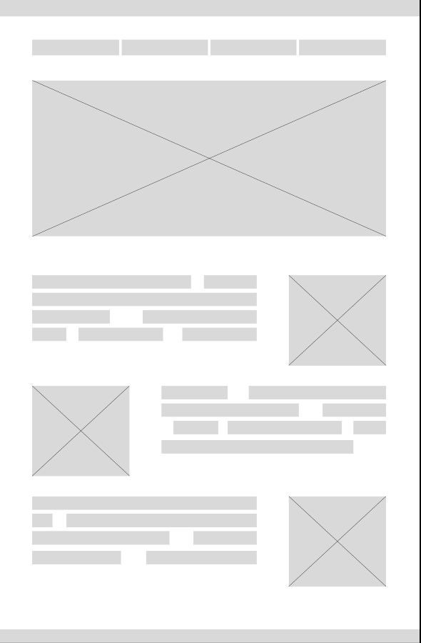

# Wireframe de Média Fidelidade - Curso de UX Designer (DIO.me)

Este repositório contém um wireframe de média fidelidade desenvolvido durante o curso de **UX Designer** da **DIO.me**.

O objetivo do exercício era aplicar boas práticas de design visual, organização de conteúdo e estruturação de páginas, simulando a proposta de um layout para uma futura aplicação web.

## 🔧 Ferramenta utilizada

- [Figma](https://www.figma.com) – ferramenta de design colaborativo e prototipação

## 🖼️ Prévia do wireframe

## 🔗 Acesse no Figma

Você também pode visualizar diretamente o protótipo no Figma por este link:

👉 [Visualizar no Figma](https://www.figma.com/proto/wnjepEChuw4q4fgCjezdHN/Untitled?type=design&node-id=2-3&t=uuRdN6ICFNcqyBSL-0&scaling=contain&page-id=0%3A1)

## 📌 Observações

- O projeto é uma entrega simples, com foco em **estrutura e usabilidade**.
- Pode servir de base para protótipos de páginas institucionais, portais de conteúdo ou até e-commerces.

---

## 👨‍💻 Autor

[www.linkedin.com/in/luis-fellipe-real](https://www.linkedin.com/in/luis-fellipe-real)
